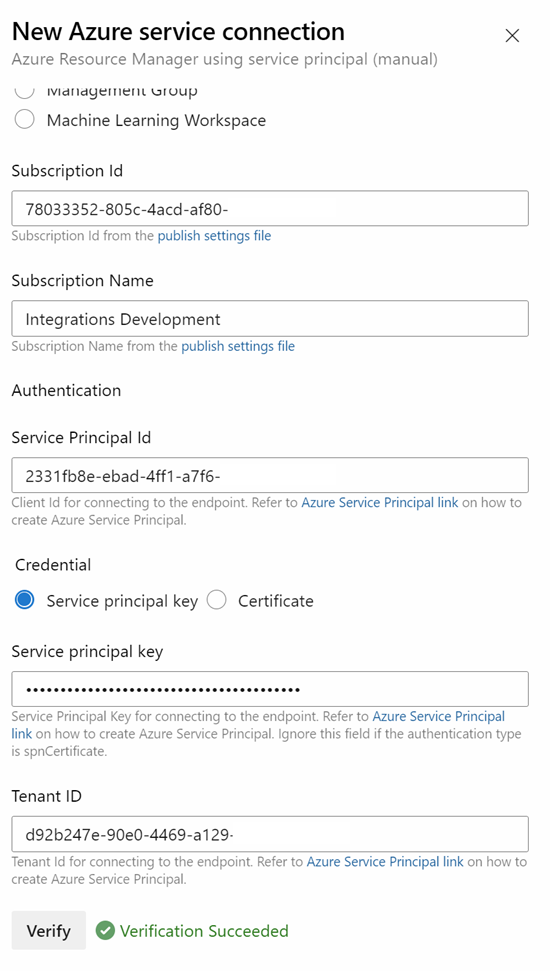

# Create Service Connection manually

Get your Subscription name and id using Azure CLI:

```bash
subscriptionName=$(az account show --query name --output tsv)
subscriptionId=$(az account show --query id --output tsv)
```

Create the service principal:

```bash
principal=sp-az400-azdo
sppwd=$(az ad sp create-for-rbac --name $principal --role contributor --scopes /subscriptions/$subscriptionId --query password --output tsv)
spid=$(az ad sp list --display-name $principal --query [0].appId --output tsv)
```

Output values for manual creation of the service connection:

```bash
echo "Subscription Id: " $subscriptionId
echo "Subscription Name: " $subscriptionName
echo "Service Principal Id: " $spid
echo "Service principal key: " $sppwd
```

